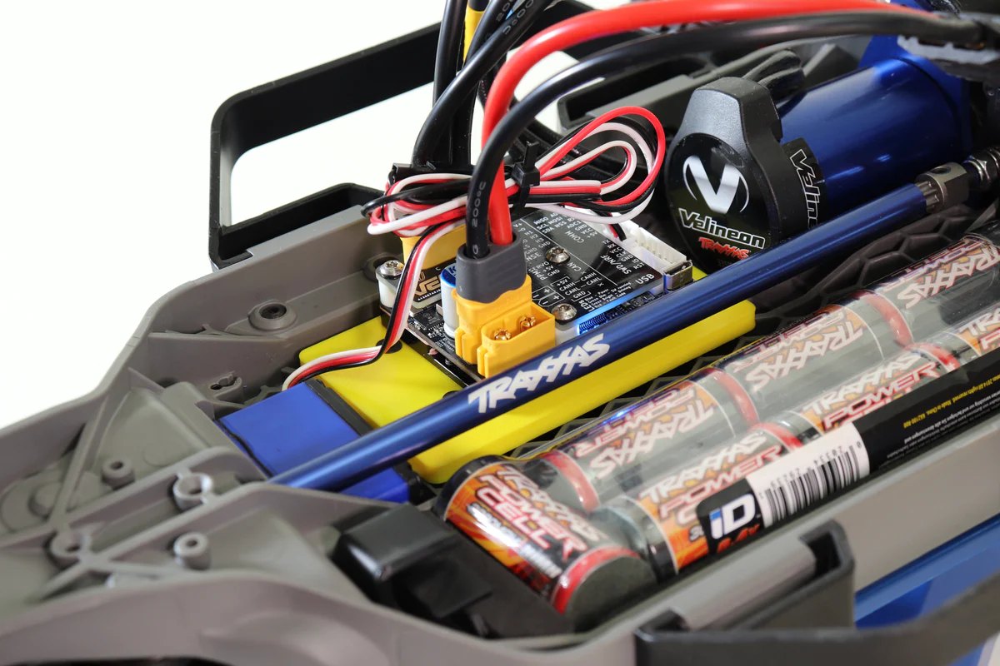

# VescEDUMount
VESC EDU mounting plate for Traxxas Slash LCG chassis

3D CAD files for a plate that mounts a VESC EDU to a Traxxas Slash LCG (Low Center of Gravity) chassis. The Traxxas Slash is a Remote Control (R/C) vehicle. The .f3d file is for Autodesk Fusion 360.

A .stl file is included for 3D printing. A word of caution, the VESC EDU may get hot. Pick an appropriate material for the plate.

To mount the VESC EDU to the plate and chassis use 6 M3x8mm countersink machine screws. Mount the VESC EDU to the plate, and then mount the plate to the chassis. Smart people like you will also make sure to route the wires to make sure that they do not contact the center driveshaft. 

The motor wiring connector on the VESC EDU is MR60, and the power connector is XT-60.

### Plate install (in yellow)

## Release Notes:

### October, 2022
* Initial Release
* Version 4 of design
